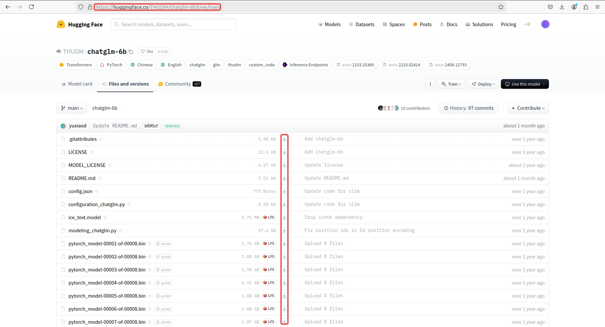
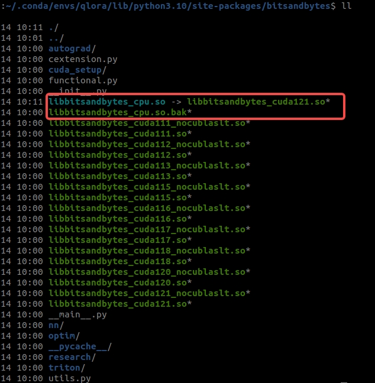
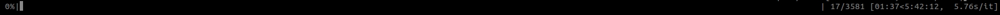
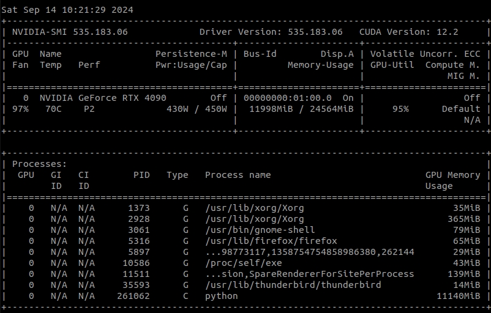

# chatglm-6b-qlora

## 介绍

本项目使用peft库，实现了ChatGLM-6B模型4bit的QLoRA高效微调，可以在一张显卡上完成全部微调过程。

内容包括：

1. 环境配置
2. 数据集介绍
3. ChatGLM-6B的QLoRA训练完整流程
4. QLoRA微调前后的效果比对

特别说明：

代码中指定`model_name_or_path`为`THUDM/chatglm-6b`的话默认会去自动下载预训练模型，因为自动下载总会遇到超时问题，本文档只提供手动下载预训练模型的方式，需要拉取代码后本地创建`THUDM`目录，然后从官网：https://huggingface.co/THUDM/chatglm-6b/tree/main 下载所有文件到`THUDM`目录下。

离线下载预训练模型：



## 环境配置

### 环境依赖

- CUDA >= 11.7

- 显卡: 显存 >= 16G (最好24G或者以上)

### 推荐环境

推荐使用conda，如下：

```shell
  conda create -n qlora python=3.10 -y
  conda activate qlora
  pip install -i https://pypi.tuna.tsinghua.edu.cn/simple -r requirements.txt
```

注意: 如果`datasets`版本太低会报错 `NotImplementedError: Loading a dataset cached in a LocalFileSystem is not supported`.

这里并没有结束，直接运行会报错 `AttributeError: ~/.conda/envs/qlora/lib/python3.10/site-packages/bitsandbytes/libbitsandbytes_cpu.so: undefined symbol: cquantize_blockwise_fp16_nf4`

需要执行下面操作：
```shell
  cd ~/.conda/envs/qlora/lib/python3.10/site-packages/bitsandbytes/
  mv libbitsandbytes_cpu.so libbitsandbytes_cpu.so.bak # 只是备份一下
  ln -s libbitsandbytes_cuda121.so libbitsandbytes_cpu.so # 创建软连接,这里的cuda121版本应该跟安装的cuda版本对齐
  cd -
```

执行操作后目录下显示效果应该如下：



## 数据集介绍

数据集使用ADGEN广告数据集，任务为根据instruction生成一段广告词，见本项目data文件夹，每条样本为一行，形式为：

```json
{
  "instruction": "类型#裤*版型#宽松*风格#性感*图案#线条*裤型#阔腿裤", 
  "output": "宽松的阔腿裤这两年真的吸粉不少，明星时尚达人的心头爱。毕竟好穿时尚，谁都能穿出腿长2米的效果宽松的裤腿，当然是遮肉小能手啊。上身随性自然不拘束，面料亲肤舒适贴身体验感棒棒哒。系带部分增加设计看点，还让单品的设计感更强。腿部线条若隐若现的，性感撩人。颜色敲温柔的，与裤子本身所呈现的风格有点反差萌。"
}
```

其中训练数据`train.jsonl`共计114599条，验证数据`dev.jsonl`共计1070条。

## 训练流程

进入本项目目录，训练启动命令如下：

```shell
  bash train.sh
```

其中`chatGLM_6B_QLoRA.json`文件为所有transformers框架支持的TrainingArguments，参考：https://huggingface.co/docs/transformers/main_classes/trainer#transformers.TrainingArguments

默认如下，可根据实际情况自行修改：

```json
{
    "output_dir": "saved_files/chatGLM_6B_QLoRA_t32",
    "per_device_train_batch_size": 4,
    "gradient_accumulation_steps": 8,
    "per_device_eval_batch_size": 4,
    "learning_rate": 1e-3,
    "num_train_epochs": 1.0,
    "lr_scheduler_type": "linear",
    "warmup_ratio": 0.1,
    "logging_steps": 100,
    "save_strategy": "steps",
    "save_steps": 500,
    "evaluation_strategy": "steps",
    "eval_steps": 500,
    "optim": "adamw_torch",
    "fp16": false,
    "remove_unused_columns": false,
    "ddp_find_unused_parameters": false,
    "seed": 42
}
```


对参数`compute_type`，可选`fp16`, `bf16`和`fp32`，实测使用`fp16`, `bf16`这两种计算速度有明显提升，相同的epoch只需要大约一半的时间，但出现loss收敛较慢的情况，默认选择`fp32`.

关于这个参数的选择，可能需要根据数据集做不同的尝试。

#### 训练截图（chatGLM-6B）

- 正在训练

  

- 显存占用，batch_size = 4
  
  

## 微调后的模型推理

训练完后模型默认保存在`saved_files/chatGLM_6B_QLoRA_t32/`目录下：

```text
-rw-rw-r-- 1  422 9月  14 11:34 adapter_config.json
-rw-rw-r-- 1 7.1M 9月  14 11:34 adapter_model.bin
-rw-rw-r-- 1  434 9月  14 11:34 README.md

```
保存的adapter只有约7M的大小。

执行下面脚本可以跑微调前后的模型效果：
```shell
  python inference_qlora.py
```

## 参考

- https://github.com/shuxueslpi/chatGLM-6B-QLoRA/tree/main